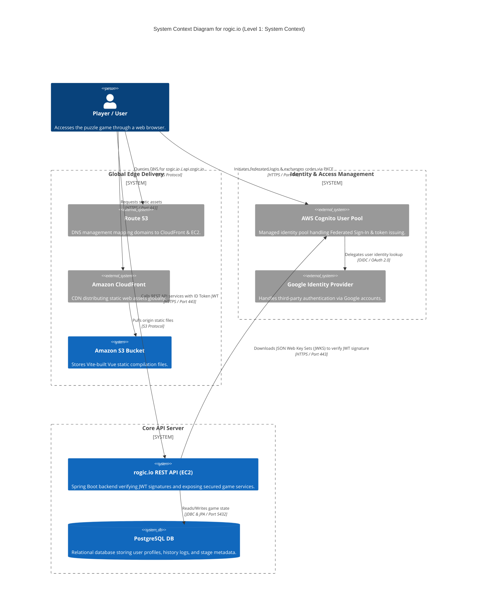
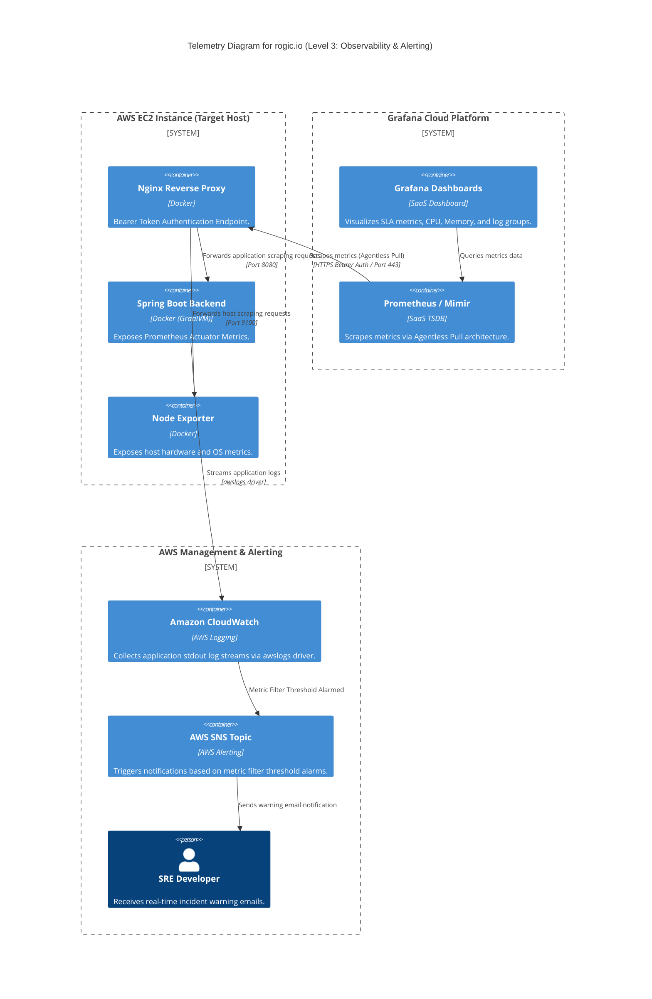
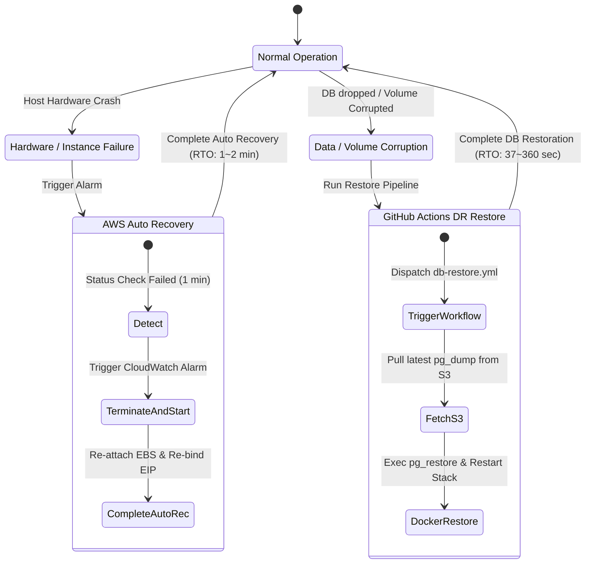
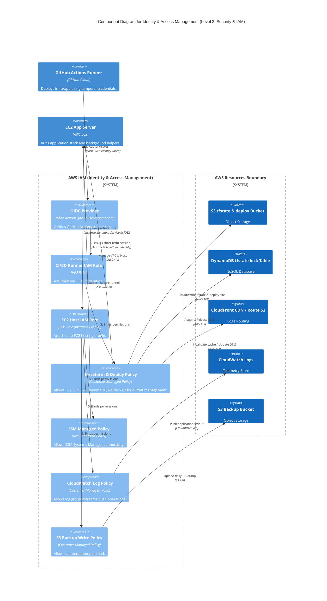
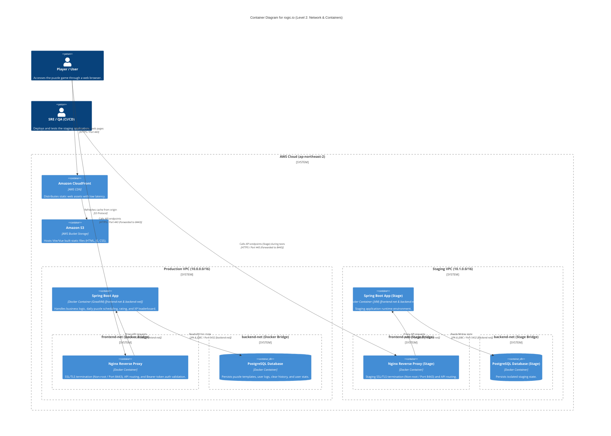
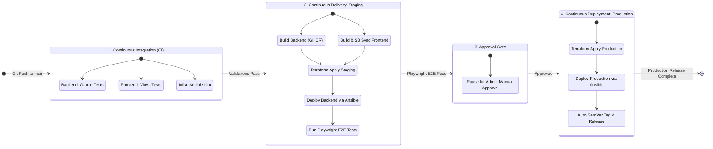

# 0. rogic.io

**rogic.io** is an intelligent web-based puzzle game that automatically generates and serves daily logic puzzles using Vue 3, Spring Boot, and AI (Gemini). The project is built with a strong emphasis on performance optimization, robust infrastructure architecture, and engineering best practices.

## 0.1. Engineering Constraints & Principles
#### Architecture Principles

  

## 0.2. Game Concept
#### Core Game Differentiators

  

#### Gameplay Video Demonstration

  <video src="./docs/assets/rogic_gameplay_intro.mp4" width="100%" autoplay loop muted playsinline></video>

## 0.3. Contributing
We welcome contributions from the community! Whether it's a bug fix, new feature, or documentation update, your help is highly appreciated.
Please read our [Contributing Guidelines](./CONTRIBUTING.md) to get started with your local development environment, testing, and pull request workflow. By participating in this project, you agree to abide by our [Code of Conduct](./CODE_OF_CONDUCT.md).

---

# 1. Infrastructure

## 1.1. System Architecture

## 1.2. Component Specifications
### 1.2.1. Compute
#### Instance Type
AWS EC2 `t3a.nano` (1 vCPU, 0.5 GiB Memory)

#### Runtime Engine
Docker / Docker Compose

#### Application Stack
Spring Boot (Compiled with GraalVM Native Image for minimal footprint, target memory consumption constrained to 30MB)

### 1.2.2. Network & Traffic
#### DNS Resolution
Route 53 Hosted Zone (Domain A record mapping)

#### IPv4 Address
AWS Elastic IP (EIP) statically allocated

#### Reverse Proxy
Docker Nginx Proxy (80/443 SSL termination and backend request forwarding)

### 1.2.3. Storage & CDN
#### Static Content
Amazon S3 (Hosting Vite/Vue static build artifacts)

#### Content Delivery Network
Amazon CloudFront (Secured with Origin Access Control (OAC))

#### Persistent Volume
AWS EBS gp3 (10 GiB storage volume)

### 1.2.4. Database
#### Database Engine
PostgreSQL 16 (Docker Container)

#### Backup Storage
S3 Backup Bucket (Database snapshots dumped periodically every 3 hours)

### 1.2.5. Staging Environment
#### Instance Lifecycle
On-Demand setup (Automatically starts during deployments and E2E test runs)

#### Resource Cleanup
Automated nightly stop workflow based on Cron schedule (`staging-cleanup.yml`)

## 1.3. Observability

### 1.3.1. Metrics & Telemetry

#### Collection Architecture
Agentless Pull (Scrapes metrics directly from Spring Actuator and Node Exporter via Nginx proxy, omitting the Grafana Agent daemon)

#### Access Security
Bearer Token verification and virtual path mapping enforced at the Nginx reverse proxy layer

#### Performance Overhead
Host resource overhead (CPU/Memory) converges close to 0%

### 1.3.2. Log Aggregation & Storage
#### Shipping Driver
`awslogs` Docker Logging Driver (aggregates live stdout console streams)

#### Storage Target
Amazon CloudWatch Logs (eliminating disk usage on the host)

#### Log Filtration
Access logging is turned off for Nginx routes `/actuator/*` and `/node-metrics`

### 1.3.3. Alerting & SLO Visualization
#### Synthetic Probes
Grafana Cloud Synthetic Monitoring (multi-region health checks across Singapore, Sydney, and Tokyo)

#### Incident Alarm
CloudWatch Logs Metric Filter alarms immediately push real-time alerts through AWS SNS to email channels

#### SLO Dashboard
Grafana API-integrated Dashboard (visualizes Availability SLA, Incidents, MTTR, MTBF KPIs. Public link: [Grafana Live Public Dashboard](https://grandwalrus3189.grafana.net/public-dashboards/ec9e06b0d1ea4540b97af6b56abb1380). Detailed PromQL specifications are documented in [docs/appendices.md](./docs/appendices.md#2-promql-query-formulations-slo-metrics))

---

## 1.4. Disaster Recovery

### 1.4.1. DR Recovery Flow

#### Auto Recovery RTO
1 to 2 minutes (CloudWatch Alarm monitors Status Check Failures and triggers immediate host physical recovery)

#### Manual Recovery RTO
37 to 360 seconds (utilizes GitHub Actions `db-restore.yml` one-click restore pipeline and SSM SendCommand automation)

### 1.4.2. Storage & Backup Design
#### Persistent Volume
AWS EBS gp3 (10 GiB volume detached from OS lifecycle, guarded with `prevent_destroy` to prevent accidental loss)

#### Volume Binding
Host Bind Mount (`/opt/nemologic/db_data` path prevents Docker named volume lifecycle data loss)

#### Database Backup
Automated database snapshot dump using `pg_dump` scheduled every 3 hours and pushed to a remote, isolated S3 backup bucket

#### Lifecycle Policy
S3 Lifecycle rules automatically delete backups older than 30 days

---

# 2. Security

## 2.1. Identity & Access Management
### 2.1.1. Host Access Control
#### Session Manager
Connections established via Systems Manager Session Manager (Inbound port 22 SSH completely disabled on the host)

#### Ansible SSM Tunnel
SSH ProxyCommand encapsulated via `aws ssm start-session` mapped with local PEM file verification (detailed setups in [docs/appendices.md](./docs/appendices.md#13-aws-ssm-session-manager-setup))

### 2.1.2. Pipeline Authentication
#### OIDC Keyless Auth
GitHub Actions federates with AWS OIDC to assume temporary STS role credentials, completely eliminating persistent static Secret Keys

#### Least Privilege Policy
Distinct Custom IAM Policies allocated to Staging and Production to isolate and block access to unauthorized AWS services

### 2.1.3. IAM Least Privilege Design

| Principal | Auth Type | Linked IAM Policies & Permissions | Key Role |
| :--- | :--- | :--- | :--- |
| **EC2 Host Role** | Instance Profile | `AmazonSSMManagedInstanceCore` Staging: `CloudWatchAgentServerPolicy` (Managed) Production: `nemologic-cloudwatch-log-policy` (Custom) `s3_backup_policy` (Custom) | Activates SSM secure tunneling, forwards application logs to CloudWatch (differentiated policy limits between Staging and Production), controls S3 upload permissions for backups. |
| **CI/CD Runner (GitHub)** | AWS OIDC (Keyless) | `nemologic-staging-github-policy` `nemologic-production-github-policy` (Custom) | Acquires one-time short-term credentials via `sts:AssumeRoleWithWebIdentity` to perform Terraform modifications and deployments without static credentials. |

### 2.1.4. User Authentication & Authorization
* **OAuth 2.0 PKCE Flow**: Employs cryptographic validation (Code Verifier & Challenge) via Hosted UI redirection to defend against authorization code interception.
* **Stateless JWT Security**: Backend utilizes Spring Security stateless validation. JWT signatures (`RS256`) are verified dynamically using AWS Cognito JWKS URI public keys.
* **Environment Redirection**: Dynamically resolves callback/sign-out URLs matching `window.location.origin` for seamless multi-environment Cognito Client integration.
* **Token Lifetime**: Restricts Access/ID Token lifetime to 5 minutes, paired with a 30-day Refresh Token limit.
* **Token Rotation**: Enforces Refresh Token rotation, invalidating and replacing the active refresh token upon every renewal query (one-time use configuration).
* **Token Revocation**: Integrates user logout triggers with Cognito Revocation endpoints to invalidate current sessions.
* **Solve Verification**: Verifies puzzle clears at the backend layer (`/api/stages/{id}/verify`), matching completion metrics before issuing an HMAC-SHA256 encrypted `proofToken` signature.
* **Tamper-proof Migration**: Verifies the guest history signature (`proofToken`) at login redirection to prevent arbitrary profile alteration or fraudulent XP acquisition.
* **Symmetric Key Cryptography**: Employs symmetric key signatures for guest clear validation to minimize CPU footprint (under 0.1ms computation latency per token check).

---

## 2.2. Infrastructure Protection

### 2.2.1. Network & Host Security
#### VPC Isolation
Blocks cross-environment network access by partitioning configurations into distinct subnet boundaries for Staging VPC (`10.1.0.0/16`) and Production VPC (`10.0.0.0/16`).

#### Port Restriction
Nginx exposes ports 80 and 443 globally, while inbound ports for SSH (22), API (8080), and dev tools remain locked to external traffic.

#### Scraping Proxy
Excludes direct access to Actuator endpoints. Prometheus scraper queries must pass token verification at the Nginx reverse proxy layer before loopback delivery to Port 8080.

### 2.2.2. Container Security
#### Network Partitioning
Isolates multi-tier components utilizing separate Docker bridge subnets: `frontend-net` (Nginx/API proxying) and `backend-net` (API/Database state operations).

#### Database Isolation
Configures the `backend-net` bridge with `internal: true` to prevent container outbound access to the public internet.

#### Non-root Execution
Employs `nginx-unprivileged:alpine` image configurations to force web server execution under a non-root account profile (UID 101).

#### Read-Only rootfs
Applies `read_only: true` on containers, isolating writable operations to temp memory mounts (`tmpfs` bound to `/tmp`).

#### Safe Backup
Encapsulates database snapshots via standardized stdout streams (`docker exec pg_dump`), preventing database credentials from leaking in backup script logs.

### 2.2.3. Security Group Configuration
#### Ingress Control
Minimizes inbound boundary open ports (only 80 and 443 are exposed).

| Port | Protocol | Source | Purpose / Service |
| :---: | :---: | :---: | :--- |
| 80 | TCP | `0.0.0.0/0` | HTTP Web server (redirects traffic to HTTPS 443) |
| 443 | TCP | `0.0.0.0/0` | Secure HTTPS Web Services, REST APIs, and scraper collection routing |

#### Egress Control
Controls outbound paths for OS upgrades and S3 updates.

| Port | Protocol | Destination | Purpose / Service |
| :---: | :---: | :---: | :--- |
| All | All | `0.0.0.0/0` | Package updates, external API requests, and DB backup synchronization to S3 |

---

## 2.3. Data Protection
#### SSL Certification
Let's Encrypt SSL certificates (port 443 encryption) managed with automated renewal triggers via Certbot hooks.

#### State Lock Management
Infrastructure configuration state files are stored encrypted on S3, coupled with DynamoDB table bindings (`LockID`) to prevent state corruption during concurrent pipeline runs.

---

# 3. CI/CD

## 3.1. Pipeline Workflow

### 3.1.1. Trigger Optimization
#### Path Filtering
Skips build triggers for pure documentation modifications (`*.md`) or changes to local configuration scripts, saving Cloud runner execution minutes.

#### Concurrency Limit
Instantly aborts outdated runs when a new push is merged during an active staging build (`cancel-in-progress: true`).

---

## 3.2. Artifact & Release Management
#### Compute Offloading
Heavy compilations and GraalVM native image generation tasks are completely offloaded to GitHub Actions runner agents (refer to [1.2.1. Compute](#121-compute)).

#### Static Asset Delivery
Frontend build bundles are synchronized to S3 via `aws s3 sync`, followed by an edge invalidation command to distribute updates via CloudFront.

#### Versioning Automation
Changelogs and Semantic Versioning tags are automatically generated by parsing standardized conventional commit logs.

---

## 3.3. Continuous Validation
### 3.3.1. Verification Gates
#### Static Analysis
Performs parallel verification checks (Ansible Lint, Gradle tests, and Vitest suite) immediately upon PR creation.

#### Trivy Vulnerability Scan
Performs SCA dependency audits, IaC static rule reviews, and container image scans before registry publication.

#### Playwright E2E Test
Initiates automated browser integration tests (`staging.spec.ts`) as soon as the staging environment deployment is complete.

### 3.3.2. Delivery Gates
#### Manual Approval
Enforces manual gate check triggers. Deployments pause after passing Staging, requiring explicit administrator approval to promote code to Production.

#### Automated DR Gate
DB restore processes (`db-restore.yml`) are executed via SSM command pipelines, wrapping AWS Systems Manager APIs for secure recovery.

---

# 4. AI Engineering

## 4.1. LLM Generation Pipeline
#### Generation Engine
Automated daily stage generation utilizing a hybrid pipeline (`gemini-3-flash` for grids, `gemini-3.5-flash` for themes), scheduled nightly at 04:17 KST.

#### Rate Limit Defense
Configured with a 15-second interval sleep and 3-stage exponential backoff logic to respect 5 RPM limits.

#### FIFO Buffer Store
A FIFO database table maintains a buffer of at least 5 ready-to-play puzzles for each size (5x5 to 20x20) to ensure continuous gameplay.

---

## 4.2. Automated Quality Guardrails
#### Logic Verification
Every generated grid is evaluated by a Java DFS backtracker (`NonogramSolver`) to ensure a single, logical, unique solution exists.

#### Data Filtering
Puzzles with multiple solutions or invalid layouts are immediately discarded before database persistence.

---

## 4.3. AI Governance & Human-in-the-Loop
#### HITL Feedback Loop
Aggregates thumbs up/down user feedback to adjust prompt structures and tune generation metrics.

#### Backoffice Hard Delete
Enforces an administrator control panel that enables hard deleting bad or deformed stages directly from the database.

#### Co-Engineering Stack
Pair programming environment centered around the **Antigravity IDE**:
* **Gemini 3.5 Flash**: IDE assistant and Chrome DevTools subagent (writes code, analyzes logs, and checks UI elements).
* **Claude Sonnet 4.6**: Analyzes code structures and reviews test case coverage.
* **Claude Opus 4.6**: High-level architectural validation and repository integrity reviews.

#### Agent Governance Rules
This repository maintains active rules defining security, style, and programming conventions for AI coding agents:

| Rule File | Description | Version Tracking |
| :--- | :--- | :--- |
| [architecture-and-tech-stack.md](.agents/rules/architecture-and-tech-stack.md) | Enforces directory separations, prevents simultaneous multi-tier modifications, blocks Vue reactive model leaks, and validates sequence order. | `Git Tracked` |
| [documentation-guidelines.md](.agents/rules/documentation-guidelines.md) | Mandates relative referencing (no absolute file schema links), defines markdown spacing rules, and requires tables for comparative metrics. | `Git Tracked` |
| [git-and-commit-guidelines.md](.agents/rules/git-and-commit-guidelines.md) | Enforces Conventional Commit rules and local commit/push configurations. | `Git Tracked (Force Added)` |
| [workflow-and-tdd.md](.agents/rules/workflow-and-tdd.md) | Enforces TDD priority for all logic layers and updates progress contexts. | `Git Tracked` |
| [safety-and-communication.md](.agents/rules/safety-and-communication.md) | Mandates halting changes for ambiguous requirements (no guessing) and awaits human approval. | `Git Tracked` |
| [incident-reporting.md](.agents/rules/incident-reporting.md) | Outlines incident report structures using postmortem analyses. | `Git Tracked` |

---

# 5. Performance & Cost Analysis
## 5.1. Operational Cost Metrics
#### Billing Period: 2026.06.01 ~ 2026.06.30

| AWS Service | Monthly Charges |
| :--- | :---: |
| **Elastic Compute Cloud (EC2 & EBS)** | USD 6.05 |
| **Virtual Private Cloud (Public IPv4)** | USD 4.07 |
| **Route 53 (Hosted Zone & Queries)** | USD 1.14 |
| **Data Transfer** | USD 0.15 |
| **Relational Database & S3** | USD 0.04 |
| **Total** | **USD 11.45** |

> **Note**: The costs above represent the minimum baseline required to run 1 Production environment. **If the Staging server is running 24/7**, EC2 (t3a.nano) instance usage, Public IPv4 allocation, and EBS storage costs will double, **increasing the estimated monthly cost to approximately $24**. To optimize costs, we recommend stopping the Staging server when it is not in use.

## 5.2. SLO Targets vs Actual Performance
#### Measurement Period: 2026.06.25 ~ 2026.07.02

| Metric KPI | SLA Actual Outcome |
| :--- | :--- |
| **Availability** | **99.98%** |
| **API Latency** | **123.4 ms** |
| **MTTR** | **11.76 Min** |
| **RPO** | **Max 3 Hours** |
| **RTO** | **Within 3 Minutes** |

## 5.3. Security Vulnerability Metrics
#### Vulnerability Target Limits
Trivy security scan limits compared against final automated deployment blocking thresholds.

| Scan Target | Component Details | Severity | Target Limit | Actual Scan Result |
| :--- | :--- | :---: | :---: | :---: |
| **SCA (Dependencies)** | Backend (Gradle), Frontend (npm) | CRITICAL / HIGH / MEDIUM | **0** / **0** / Minimize | **0** / **0** / 0 (Clean) |
| **IaC (Infrastructure as Code)** | Terraform, Ansible, Dockerfile | CRITICAL / HIGH / MEDIUM | **0** / **0** / Minimize | **0** / **0** / 0 (Clean) |
| **Container (Backend Image)** | ghcr.io/devdoyen/nemologic-backend | CRITICAL / HIGH | **0** / **0** | **0** / **0** (Clean) |

## 5.4. User & System Traffic Metrics
#### Traffic Accumulation
Measurement Period: 2026.06.25 ~ 2026.07.02

| Metric KPI | SLA Actual Outcome |
| :--- | :--- |
| **Active Users** | 39 |
| **Total Events** | 535 |
| **Average Engagement** | 2m 53s |
| **Daily Generated** | 60+ stages |

---

# 6. Troubleshooting & Incidents

## 6.1. Host Memory Exhaustion Incident
#### Symptom
Host memory depletion, OOM events, and disk I/O thrashing occurred on the t3a.nano (512MB RAM) instance due to monitoring agent resource limits.

#### Root Cause
The collection agent (Grafana Alloy) consumed excessive memory (100MB+), causing resource exhaustion when coupled with high I/O spikes during container image extractions.

#### Mitigation
* **Agentless Architecture**: Discarded the host collection agent. Replaced it with an agentless pull structure where Grafana Mimir scrapes metrics directly from Node Exporter/Spring Actuator via Nginx proxy paths.
* **GraalVM Native Image**: Compiled the Spring Boot API server into a native binary, reducing active memory consumption to under 30MB.
* **Memory Buffer**: Added a 2GB SWAP space and configured automatic garbage collection for Docker images.

#### Retrospective
Proven that low-spec hardware limits can be overcome by tracking resources using low-level tools (`top`, `vmstat`) and optimizing compilers (GraalVM native AOT) coupled with virtual memory buffers.

---

## 6.2. Deployment Pipeline Conflict
#### Symptom
1. Access denied errors occurred on the site because DNS switches occurred before S3 asset replication completed.
2. Deployment runs were aborted during hotfixes, causing SSL certificate failures.

#### Root Cause
1. Development and Staging infra configurations were coupled in the same Terraform workspace, failing to isolate the blast radius.
2. The `cancel-in-progress: true` option was misconfigured, killing runs during active certificate provisioning.

#### Mitigation
* **Workspace Isolation**: Partitioned Terraform state configurations using distinct directories for Staging and Production.
* **Fine-Tuned Concurrency**: Enforced `cancel-in-progress: false` for production stages to prevent transaction interruptions.
* **Manual Verification Gate**: Added a manual approval gate before DNS routing switches.

#### Retrospective
Stateful transactions must be protected against sudden abort signals, and critical updates should be protected by manual approvals.

---

## 6.3. AI Puzzle Generation Parsing Incident
#### Symptom
The daily stage generation pipeline crashed with a serialization exception (`JsonParseException`).

#### Root Cause
Under heavy 30x30 calculations, the LLM returned shorthand JavaScript code (e.g. `Array(30).fill(0)`) instead of raw, valid 2D JSON array structures.

#### Mitigation
* **Prompt Engineering**: Enforced the `MUST be a literal 2D JSON array` constraint in prompt definitions.
* **Buffer Safety**: Reduced the daily generation batch size from 5 concurrent puzzles to 2.

#### Retrospective
When parsing non-deterministic LLM outputs in batch services, raw schema validation boundaries should be enforced at the entry point.

---

## 6.4. Production Database Initialization
#### Symptom
The production database (user profiles, clears, custom stages) was wiped during an IAM update deployment that forced an EC2 recreation.

#### Root Cause
* **Coupled Lifecycle** 
  The database was mounted on Docker named volumes within the EC2 host lifecycle. When the instance was destroyed, the data was lost.
* **Silent Backup Failure** 
  The backup script failed silently due to a missing S3 list permission (`s3:ListAllMyBuckets`). Standard error routing to `/dev/null` masked the failure for months.

#### Mitigation
* **Lifecycle Protections (`prevent_destroy`)** 
  Enforced `prevent_destroy = true` for the EC2 host instances in [main.tf](./infra/terraform/envs/production/main.tf).
* **EBS Storage Isolation** 
  Created a separate AWS EBS gp3 volume (10GB) and migrated database mounts to host directory bindings (`/opt/nemologic/db_data`) to decouple data from instance lifecycles.
* **Silent Error Correction** 
  Replaced S3 bucket query calls in the backup script with direct Ansible variable injections, avoiding access checks. Removed error redirect suppression to capture Cron failures in log streams.
* **One-Click Disaster Recovery** 
  Deployed restore scripts ([restore_db.sh.j2](./infra/ansible/templates/restore_db.sh.j2)) and a workflow (`db-restore.yml`) using SSM commands. Verified a recovery time (RTO) of 37~38 seconds.

#### Retrospective
Stateful storage must be decoupled from compute instances, and recovery workflows must be regularly tested to ensure RTO metrics are met.
