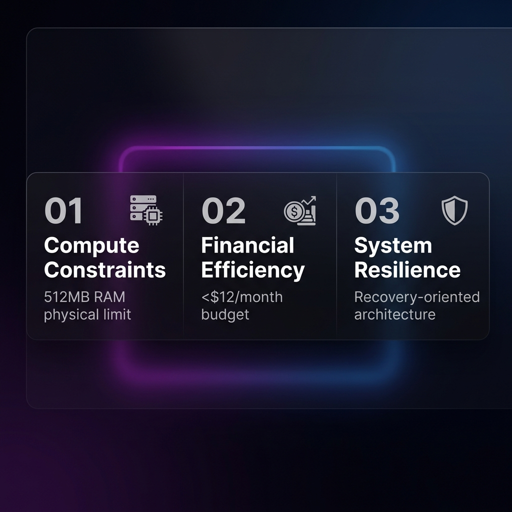
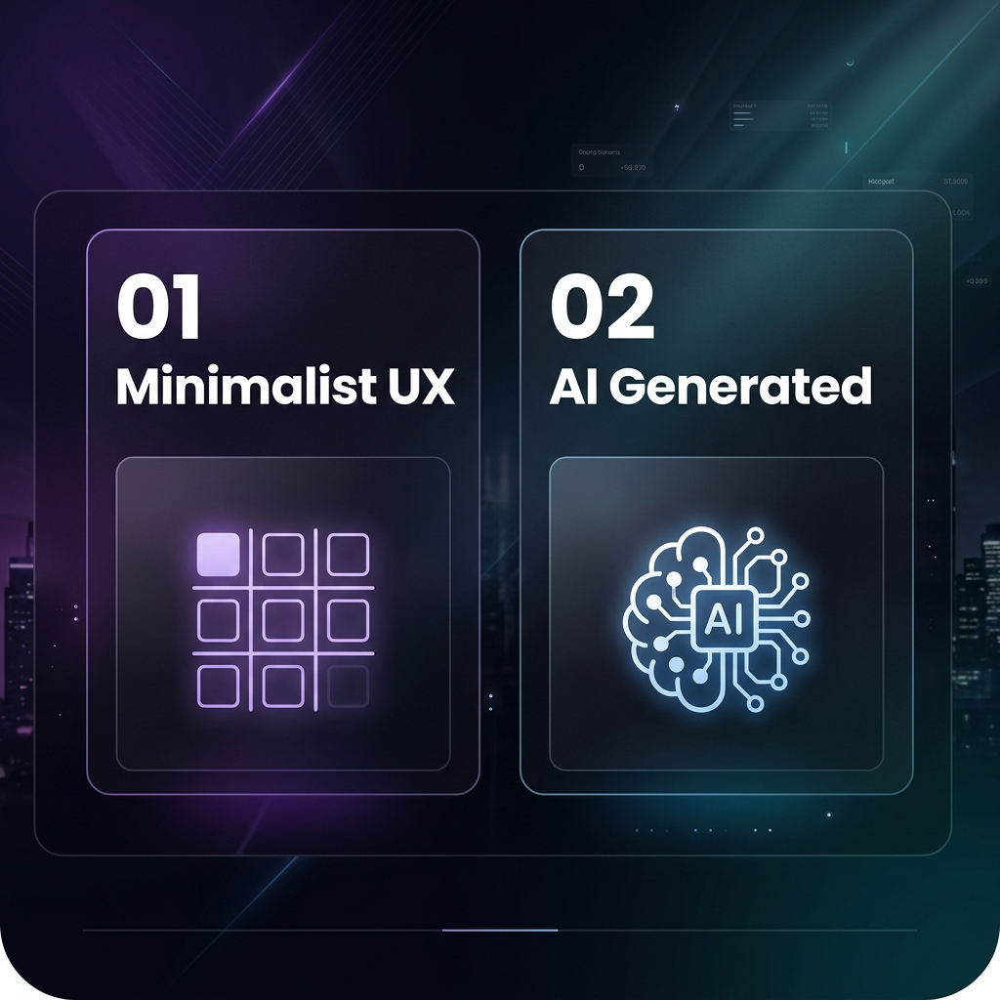
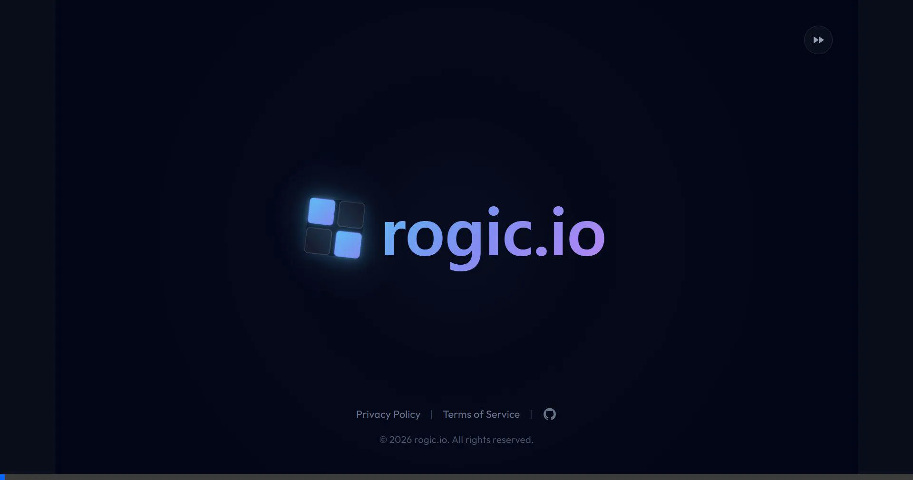
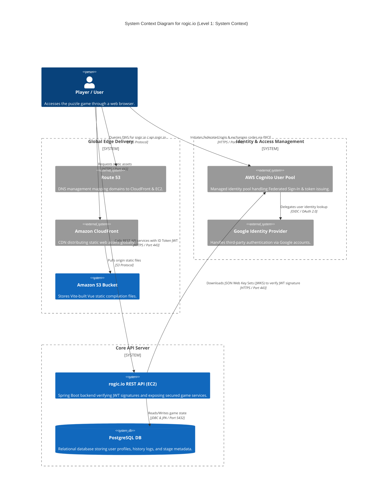
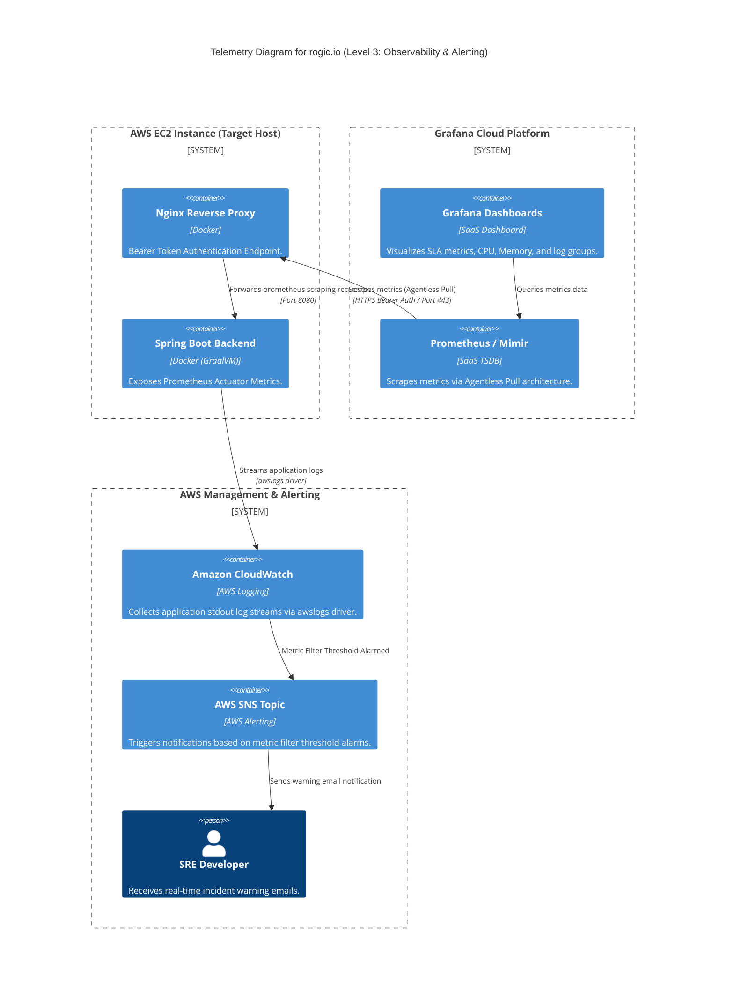
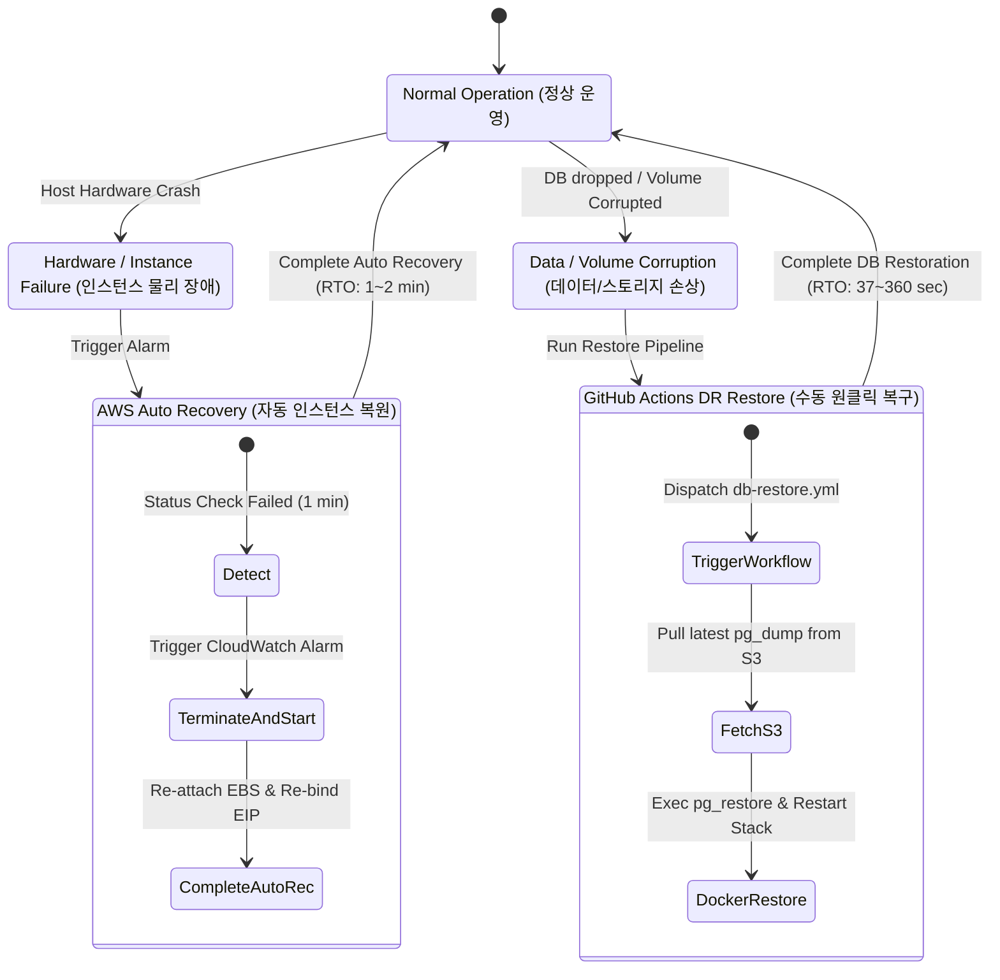
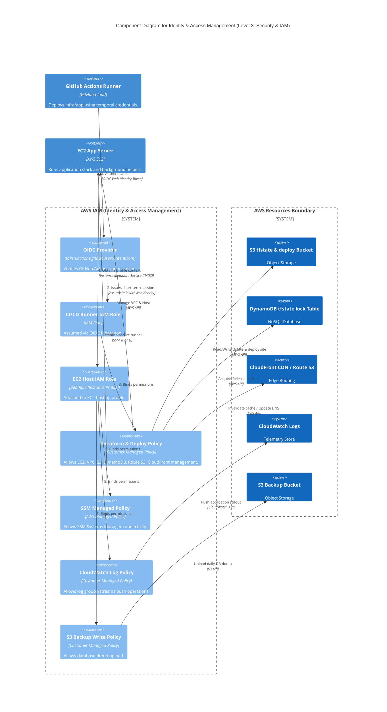
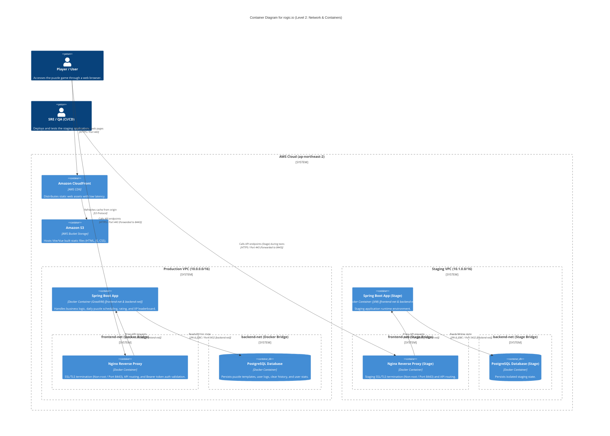
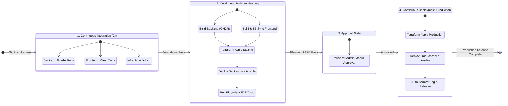

# 0. rogic.io

## 0.1. Engineering Constraints & Principles
#### Design Philosophy

  

## 0.2. Game Concept
#### Core Game Differentiators

  

#### Gameplay Video Demonstration

  

---

# 1. Infrastructure

## 1.1. System Architecture

## 1.2. Component Specifications
### 1.2.1. Compute
#### Instance Type
AWS EC2 `t3a.nano` (1 vCPU, 0.5 GiB Memory)

#### Runtime Engine
Docker / Docker Compose

#### Application Stack
Spring Boot (GraalVM Native Image 컴파일 적용, 메모리 점유 30MB 임계 설계)

### 1.2.2. Network & Traffic
#### DNS Resolution
Route 53 호스팅 영역 (도메인 A 레코드 맵핑)

#### IPv4 Address
AWS Elastic IP (EIP) 고정 공인 IP 할당

#### Reverse Proxy
Docker Nginx Proxy (80/443 SSL 종단 및 백엔드 포워딩)

### 1.2.3. Storage & CDN
#### Static Content
Amazon S3 (Vite Vue 정적 빌드 자산 저장)

#### Content Delivery Network
Amazon CloudFront (OAC 보안 권한 연결)

#### Persistent Volume
AWS EBS gp3 (10 GiB 스토리지 볼륨)

### 1.2.4. Database
#### Database Engine
PostgreSQL 16 (Docker Container)

#### Backup Storage
S3 Backup Bucket (3시간 주기 데이터 스냅샷 적재)

### 1.2.5. Staging Environment
#### Instance Lifecycle
On-Demand 기동식 (배포/E2E 테스트 시점 자동 Start)

#### Resource Cleanup
Cron Schedule 기반 야간 정지 자동화 (`staging-cleanup.yml`)

## 1.3. Observability

### 1.3.1. Metrics & Telemetry

#### Collection Architecture
Agentless Pull (에이전트 데몬 배제 및 Mimir 직접 수집)

#### Access Security
Nginx Reverse Proxy단 Bearer Token 상호 검증 및 가상 경로 바인딩

#### Performance Overhead
호스트 내부 리소스(CPU/MEM) 점유 부하 0% 수렴

### 1.3.2. Log Aggregation & Storage
#### Shipping Driver
`awslogs` Docker Logging Driver (실시간 콘솔 출력 수집)

#### Storage Target
Amazon CloudWatch Logs (호스트 디스크 점유 배제)

#### Log Filtration
Nginx `/actuator/*` 및 `/node-metrics` 경로 Access Log 로깅 off

### 1.3.3. Alerting & SLO Visualization
#### Synthetic Probes
Grafana Cloud Synthetic Monitoring (Singapore, Sydney, Tokyo 3중 엣지 헬스체크)

#### Incident Alarm
CloudWatch Logs Metric Filter 임계값 초과 경보 -> AWS SNS 이메일 즉시 전파

#### SLO Dashboard
Grafana API-integrated Dashboard (Uptime SLA, Incident, MTTR, MTBF KPI 연동, 예시 링크: [Grafana Live Public Dashboard](https://grandwalrus3189.grafana.net/public-dashboards/ec9e06b0d1ea4540b97af6b56abb1380) / 상세 PromQL 명세는 [docs/appendices.md](file:///c:/Users/82107/dev/project/nemologic/docs/appendices.md#2-promql-query-formulations-slo-metrics) 참고)

---

## 1.4. Disaster Recovery

### 1.4.1. DR Recovery Flow

#### Auto Recovery RTO
1 ~ 2분 (Status Check Fail 감지 시 CloudWatch Alarm 및 호스트 물리 복원 즉시 수행)

#### Manual Recovery RTO
37 ~ 360초 (GitHub Actions `db-restore.yml` 원클릭 복구 파이프라인 및 SSM SendCommand 가동)

### 1.4.2. Storage & Backup Design
#### Persistent Volume
AWS EBS gp3 (10 GiB 독립 탑재, prevent_destroy 및 OS 영역 분리 보존)

#### Volume Binding
Host Bind Mount (`/opt/nemologic/db_data` 경로 볼륨 유실 원천 차단)

#### Database Backup
3시간 주기 `pg_dump` 자동 덤프 스케줄링 및 S3 백업 버킷 원격 격리 소산

#### Lifecycle Policy
30일 경과 노후 스냅샷 S3 Lifecycle 규격 기반 자동 영구 파기

---

# 2. Security

## 2.1. Identity & Access Management
### 2.1.1. Host Access Control
#### Session Manager
Systems Manager Session Manager 경유 접속 (호스트 인바운드 22 SSH 완전 차단)

#### Ansible SSM Tunnel
`aws ssm start-session` SSH ProxyCommand 프록시 캡슐화 및 로컬 PEM 인증 결합 (상세 구성은 [docs/appendices.md](file:///c:/Users/82107/dev/project/nemologic/docs/appendices.md#13-aws-ssm-session-manager-setup) 참고)

### 2.1.2. Pipeline Authentication
#### OIDC Keyless Auth
GitHub Actions OIDC 연동 STS 단기 자격 증명(`AssumeRole`) 위임 (Secret Key 노출 원천 제거)

#### Least Privilege Policy
Staging/Production 별 전용 Custom IAM Policy 할당을 통한 타서비스 자원 접근 차단

### 2.1.3. IAM Least Privilege Design

| 주체 (Principal) | 인증 방식 (Auth Type) | 연결된 IAM 정책 및 권한 (IAM Policies) | 주요 역할 및 비고 (Key Role) |
| :--- | :--- | :--- | :--- |
| **EC2 Host Role** | Instance Profile | `AmazonSSMManagedInstanceCore` Staging: `CloudWatchAgentServerPolicy` (관리형) Production: `nemologic-cloudwatch-log-policy` (커스텀) `s3_backup_policy` (커스텀) | SSM 터널링 활성화, CloudWatch 로그 실시간 포워딩(Staging/Production 별 정책 차등 적용), DB 백업 S3 업로드 권한 제어 |
| **CI/CD Runner (GitHub)** | AWS OIDC (Keyless) | `nemologic-staging-github-policy` `nemologic-production-github-policy` (커스텀) | `sts:AssumeRoleWithWebIdentity`를 통해 GitHub Actions OIDC 토큰으로 1회용 단기 자격 증명을 획득하여 Terraform 및 배포 수행 (Secret Key 하드코딩 배제 및 최소 권한 수립) |

### 2.1.4. User Authentication & Authorization
* **OAuth 2.0 PKCE Flow**: Hosted UI 기반 암호학적 임의 키 검증(Code Verifier & Challenge)을 통한 토큰 갈취 방어
* **Stateless JWT Security**: Spring Security 무상태 검증 및 AWS JWKS URI 동적 키 조회 서명 검증(`RS256`)
* **Environment Redirection**: `window.location.origin` 기반 인증 콜백/로그아웃 URL 동적 해석 및 Cognito Client 매핑
* **Token Lifetime**: Access/ID Token 수명 5분 단축 설정 및 Refresh Token 30일 설정
* **Token Rotation**: 갱신 요청 시마다 Refresh Token 무효화 및 신규 발급(One-time Use) 강제화
* **Token Revocation**: 사용자 로그아웃 요청 시 Cognito Revocation Endpoint 연동 강제 무효화
* **Solve Verification**: 게스트 풀이 완료 시 백엔드 검증(`/api/stages/{id}/verify`)을 통한 정답 대조 및 HMAC-SHA256 서명 인증 토큰(`proofToken`) 발행
* **Tamper-proof Migration**: 로그인 전환 시 게스트 이력의 `proofToken` 서명을 백엔드에서 검증하여 무단 전적 갱신 및 XP 획득 차단
* **Symmetric Key Cryptography**: 대칭키 서명 방식을 채택하여 다중 토큰 검증 연산 부하(개당 0.1ms 미만) 최소화

---

## 2.2. Infrastructure Protection

### 2.2.1. Network & Host Security
#### VPC Isolation
Staging VPC(`10.1.0.0/16`)와 Production VPC(`10.0.0.0/16`) 서브넷 분리를 통한 접근 차단

#### Port Restriction
Nginx 외부 개방 포트(80, 443) 제한 및 SSH(22)/API/Vite 포트 인바운드 차단

#### Scraping Proxy
Actuator 포트(8080) 직접 호출 차단 및 Nginx Bearer 토큰 검증 통과 트래픽만 로컬 루프백 전달

### 2.2.2. Container Security
#### Network Partitioning
Nginx 프록시(`frontend-net`)와 DB 컨테이너(`backend-net`) 간 다계층 도커 가상망 격리

#### Database Isolation
`backend-net` 브리지에 `internal: true` 지정하여 DB 아웃바운드 인터넷 차단

#### Non-root Execution
`nginx-unprivileged:alpine` 채택을 통한 비특권 전용 계정(UID 101) 구동 강제화

#### Read-Only rootfs
컨테이너 `read_only: true` 적용 및 쓰기 활동용 `tmpfs` 메모리 마운트 `/tmp` 격리

#### Safe Backup
Docker API 표준 출력 파이프라인(`docker exec pg_dump`) 캡슐화를 통한 패스워드 노출 차단

### 2.2.3. Security Group Configuration
#### Ingress Control
외부 인터넷 경계점 인바운드 포트 최소화 (80, 443 포트만 오픈)

| 허용 포트 (Port) | 프로토콜 (Protocol) | 소스 (Source) | 목적 및 대상 서비스 |
| :---: | :---: | :---: | :--- |
| 80 | TCP | `0.0.0.0/0` | Nginx HTTP 웹 서버 (HTTPS 301 리다이렉트용) |
| 443 | TCP | `0.0.0.0/0` | Nginx HTTPS 보안 웹 서비스 및 API 통신 (모니터링 스크래핑 포함) |

#### Egress Control
패키지 갱신 및 S3 백업 전송을 위한 아웃바운드 전송 통제

| 허용 포트 (Port) | 프로토콜 (Protocol) | 대상 (Destination) | 비고 |
| :---: | :---: | :---: | :--- |
| All | All | `0.0.0.0/0` | 패키지 업데이트, 외부 API 호출 및 DB 백업 S3 업로드용 |

---

## 2.3. Data Protection
#### SSL Certification
Let's Encrypt SSL/TLS 443 통신 및 Certbot 자동 갱신 pre/post 훅 스케줄러 연동

#### State Lock Management
AWS S3 버킷 암호화 저장 및 DynamoDB 테이블(`LockID`) Backend 지정을 통한 형상 충돌 차단

---

# 3. CI/CD

## 3.1. Pipeline Workflow

### 3.1.1. Trigger Optimization
#### Path Filtering
단순 문서 수정(`*.md`) 이나 로컬 설정 유입 시 빌드 스킵 (Actions 컴퓨팅 시간 절감)

#### Concurrency Limit
Staging 배포 중 신규 커밋 유입 시 이전 배포 즉시 취소 (`cancel-in-progress: true`)

---

## 3.2. Artifact & Release Management
#### Compute Offloading
빌드 및 Native 컴파일 연산을 GitHub Actions 클라우드 환경으로 완전 오프로딩 (상세 사양은 [1.2.1. Compute](#121-compute) 및 [1.3.1. Compute Limit](#131-compute-limit) 참고)

#### Static Asset Delivery
Vite 컴파일 정적 파일 bundle S3 다이렉트 동기화(`aws s3 sync`) 및 CloudFront Edge Invalidation 트리거

#### Versioning Automation
커밋 헤더(`feat:`, `fix:`) 규격 파싱을 통한 Semantic Versioning 자동 갱신 및 Changelog 자동 작성

---

## 3.3. Continuous Validation
### 3.3.1. Verification Gates
#### Static Analysis
PR 생성 시 단위 테스트(Gradle/Vitest) 및 Ansible Lint 정적 검사 병렬 수행

#### Trivy Vulnerability Scan
SCA 의존성 스캔, IaC 정적 진단, Docker Image 취약점 전수 스캔 (GHCR push 전 실행)

#### Playwright E2E Test
Staging 배포 완료 즉시 브라우저 E2E 테스트(`staging.spec.ts`) 자동 구동

### 3.3.2. Delivery Gates
#### Manual Approval
Staging 검증 통과 후 배포 중단 및 관리자 직접 환경 승인(Approval Gate) 통과 시에만 Production 승격

#### Automated DR Gate
원클릭 DR 워크플로우(`db-restore.yml`) 및 AWS SSM/SSM SendCommand를 경유한 복구 스크립트 실행 제어

---

---

# 4. AI Engineering

## 4.1. LLM Generation Pipeline
#### Generation Engine
`gemini-3.1-flash-lite` LLM API 비동기 스케줄러 (매일 새벽 04:17 KST)

#### Rate Limit Defense
5초의 지연 간격(Delay Interval) 및 3회의 지수 백오프 재시도(Exponential Retry) 설계

#### FIFO Buffer Store
크기별(5x5 ~ 20x20) 최소 5개 이상의 예비 퍼즐 데이터 DB 테이블 선입선출 상시 적재

---

## 4.2. Automated Quality Guardrails
#### Logic Verification
Java 기반 DFS 백트래킹 솔버 알고리즘(`NonogramSolver`)을 구동한 유일해(Unique Solution) 검증

#### Data Filtering
논리 검증 오류 및 다중 해(Multiple Solutions) 판정 데이터 적재 전 즉시 버기(Discard) 처리

---

## 4.3. AI Governance & Human-in-the-Loop
#### HITL Feedback Loop
사용자 게임 클리어 시점 👍/👎 피드백 DB 테이블 집계 및 프롬프트 튜닝 지표 활용

#### Backoffice Hard Delete
평점 불량/기형 스테이지 식별 시 관리자 단일 클릭 기반 DB 하드 딜리트 프로세스 수립

#### Co-Engineering Stack
**Antigravity IDE** 환경 중심의 이종 AI LLM 협업 페어 프로그래밍 체계 구축
* **Gemini 3.5 Flash**: IDE 및 Chrome DevTools 결합 (코드 작성 및 클라우드 로그 분석, UI 픽셀 점검 상시 수행)
* **Claude Sonnet 4.6**: 소스코드 의미론적 분석 및 테스트케이스 정적 진단/피드백 검토
* **Claude Opus 4.6**: 최상위 아키텍처 점검 및 포트폴리오 무결성 전수 검수

#### Agent Governance Rules
AI 코딩 에이전트와 협업하여 지속 가능한 리스크 관리 및 고신뢰성 코딩 컨벤션을 준수하기 위해 정의된 파일 목록입니다:

  | 규칙 파일 | 주요 관리 목적 및 정책 요약 | 형상 추적 여부 |
  | :--- | :--- | :--- |
  | [architecture-and-tech-stack.md](.agents/rules/architecture-and-tech-stack.md) | 프론트/백엔드/인프라 레이어의 다중 동시 수정 차단, Vue Reactivity 논리 유출 방지, 순차 배포 준수 | `Git Tracked` |
  | [documentation-guidelines.md](.agents/rules/documentation-guidelines.md) | 상대경로(file:// 금지) 사용, 마크다운 개행 규정 준수, 비교 수치 데이터 기술 시 테이블(Table) 시각화 의무화 | `Git Tracked` |
  | [git-and-commit-guidelines.md](.agents/rules/git-and-commit-guidelines.md) | Conventional Commits 규칙 준수, 로컬 커밋 자동 보존 및 원격 push 개발자 위임 | `Git Tracked (Force Added)` |
  | [workflow-and-tdd.md](.agents/rules/workflow-and-tdd.md) | 코어 로직 작성 시 TDD(Test-Driven Development) 선행 의무화 및 progress_state.md 수시 동기화 | `Git Tracked` |
  | [safety-and-communication.md](.agents/rules/safety-and-communication.md) | 요구사항이 모호한 경우 임의 구현(No Guessing)을 중단하고 개발자 승인 대기 | `Git Tracked` |
  | [incident-reporting.md](.agents/rules/incident-reporting.md) | 장애 리포트 작성 시 3W1H 사상에 근거한 구체적 원인-결과 수치 명세 및 포스트모템 구조화 | `Git Tracked` |

---

---

# 5. Performance & Cost Analysis
## 5.1. Operational Cost Metrics
#### Billing Period: 2026.06.01 ~ 2026.06.30

| AWS Service | Monthly Charges |
| :--- | :---: |
| **Elastic Compute Cloud (EC2 & EBS)** | USD 6.05 |
| **Virtual Private Cloud (Public IPv4)** | USD 4.07 |
| **Route 53 (Hosted Zone & Queries)** | USD 1.14 |
| **Data Transfer** | USD 0.15 |
| **Relational Database & S3** | USD 0.04 |
| **Total** | **USD 11.45** |

## 5.2. SLO Targets vs Actual Performance
#### Measurement Period: 2026.06.25 ~ 2026.07.02

| Metric KPI | SLA Actual Outcome |
| :--- | :--- |
| **Availability** | **99.98%** |
| **API Latency** | **123.4 ms** |
| **MTTR** | **11.76 Min** |
| **RPO** | **Max 3 Hours** |
| **RTO** | **Within 3 Minutes** |

## 5.3. Security Vulnerability Metrics
#### Vulnerability Target Limits
Trivy security scan limits compared against final automated deployment blocking thresholds.

| Scan Target | Component Details | Severity | Target Limit | Actual Scan Result |
| :--- | :--- | :---: | :---: | :---: |
| **SCA (Dependencies)** | Backend (Gradle), Frontend (npm) | CRITICAL / HIGH / MEDIUM | **0** / **0** / Minimize | **0** / **0** / 0 (Clean) |
| **IaC (Infrastructure as Code)** | Terraform, Ansible, Dockerfile | CRITICAL / HIGH / MEDIUM | **0** / **0** / Minimize | **0** / **0** / 0 (Clean) |
| **Container (Backend Image)** | ghcr.io/devdoyen/nemologic-backend | CRITICAL / HIGH | **0** / **0** | **0** / **0** (Clean) |

## 5.4. User & System Traffic Metrics
#### Traffic Accumulation
Measurement Period: 2026.06.25 ~ 2026.07.02

| Metric KPI | SLA Actual Outcome |
| :--- | :--- |
| **Active Users** | 39 |
| **Total Events** | 535 |
| **Average Engagement** | 2m 53s |
| **Daily Generated** | 60+ stages |

# 6. Troubleshooting & Incidents

## 6.1. Host Memory Exhaustion Incident
#### Symptom
t3a.nano(512MB RAM) 환경에서 모니터링 Alloy 수집기 메모리 초과 및 컨테이너 중복 기동 OOM/디스크 I/O 스래싱 발생

#### Root Cause
수집기 Alloy 데몬 자원 과점(100MB+) 및 이미지 압축 해제 순간의 대용량 I/O 병목에 따른 가용 메모리 고갈

#### Mitigation
* **Agentless 전환**: 수집기 배제 및 Nginx reverse proxy를 경유한 Mimir의 Prometheus Pull 방식으로 개편
* **풋프린트 Native화**: GraalVM Native Image 컴파일 옵션을 도입하여 서버 실행 점유 메모리를 30MB 이하로 압축
* **시스템 완충**: 2GB 크기 SWAP 파티션 기동 및 도커 안 쓰는 이미지 주기적 자동 정리 GC 크론 스케줄링 연동

#### Retrospective
저스펙 하드웨어 한계도 저수준 진단(`top`, `vmstat`)을 활용해 리소스를 추적하고, Native 컴파일 등 경량 런타임 최적화와 가상 메모리 설정을 결합하여 고가용성 복구 지향적 운영(ROA)으로 돌파할 수 있음을 실증함

---

## 6.2. Deployment Pipeline Conflict
#### Symptom
1. S3 정적 자산 시딩 이전 DNS 스위칭이 선행되어 운영계 접속 차단 (`AccessDenied`) 발생
2. 핫픽스 도중 빌드가 강제 취소되어 SSL 인증서 발급 오류 및 HTTPS API 먹통 발생

#### Root Cause
1. Staging과 Production 인프라 설정이 동일 Terraform 코드에 커플링되어 영향 범위(Blast Radius) 격리 실패
2. Actions `cancel-in-progress: true` 옵션 오용으로 Nginx 암호화 인증서 발급 트랜잭션 도중 빌드가 강제 중단됨

#### Mitigation
* **인프라 물리 격리**: Terraform Workspace 및 디렉토리 설정을 Staging/Production으로 완전 독립 격리
* **동시성 옵션 세밀화**: 실 운영 배포 단계(`deploy-production`)에서 `cancel-in-progress: false` 지정을 의무화
* **수동 승인 게이트**: 인증서 교체 및 배포 전 준비 상태 검증용 Manual Approval Gate 및 느슨한 결합(Loose Coupling) 도입

#### Retrospective
파이프라인 최적화 옵션이라도 상태 변경(State change)이 일어나는 트랜잭션 구간에서는 정합성 훼손 방지를 위해 정교하게 제한해야 하며, 배포 전 단계를 수동 승인 게이트 등으로 명시적 안전장치화해야 함을 배움

---

## 6.3. AI Puzzle Generation Parsing Incident
#### Symptom
AI 데일리 퍼즐 자동 생성 스케줄러 배치 중, 백엔드 역직렬화 오류(`JsonParseException`) 및 생성 파이프라인 전체 중단 발생

#### Root Cause
경량 LLM 모델이 대형(30x30) 퍼즐을 연산하면서 JSON 문자열 대신 `Array(30).fill(0)` 등 JS 단축 코드식 데이터 구조를 반환하여 역직렬화 실패

#### Mitigation
* **프롬프트 가드레일**: 프롬프트 명세서 상에 `MUST be a literal 2D JSON array` 제약 조건 강제 명시
* **토큰 안정성 확보**: 출력 토큰 안전성 확보를 위해 한번에 생성하는 후보군(Candidate) 개수를 5개에서 2개로 조정

#### Retrospective
비결정적인 LLM의 추론 출력을 실시간 배치 서비스에 바인딩할 때는, 스키마 가드레일(Schema Guardrails)을 강제 규칙으로 명시하고 토큰 제한을 타이트하게 제어하여 시스템 입력 정합성을 유지해야 함을 규명함

---

## 6.4. Production Database Initialization

#### Symptom
테라폼 IAM 권한 수정 배포 중 단일 EC2 인스턴스가 재구축(Destroy and Recreate)되면서, 도커 Named Volume에 적재되어 있던 운영계 PostgreSQL 데이터베이스(사용자 전적 및 커스텀 퍼즐)가 영구적으로 유실되는 전면 장애 발생

#### Root Cause
* **인스턴스 커플링** 
  DB 컨테이너의 영속 스토리지 볼륨이 독립적인 외부 EBS로 분리되지 않고 인스턴스 소멸과 생명주기를 같이하는 Named Volume 구조로 설계되어 인스턴스 파괴 시 물리 데이터 소멸 유발
* **백업 파이프라인 무음 실패 (Silent Failure)** 
  최소 권한 원칙(Least Privilege)에 따라 AWS S3 백업 IAM 정책에 `s3:ListAllMyBuckets` 권한이 배제되어 백업 스크립트가 Access Denied로 에러 처리됨. 그러나 크론탭 표준 에러 누락 설정(`> /dev/null 2>&1`)으로 인해 수개월 동안 실패 상태가 관제되지 못하고 방치됨

#### Mitigation
* **EC2 강제 파괴 수명주기 보호 (prevent_destroy)** 
  Staging 및 Production 인프라 테라폼 구성 파일([main.tf](./infra/terraform/envs/production/main.tf))의 EC2 리소스에 `prevent_destroy = true` 선언을 의무화하여 형상 변경 시의 인스턴스 파괴를 방지함
* **EBS 볼륨 물리 격리 및 바인드 마운트 마이그레이션** 
  독립형 AWS EBS gp3 볼륨(10GB)을 신설 프로비저닝하고, Docker PostgreSQL 볼륨 구조를 호스트 절대 경로 바인드 마운트(`/opt/nemologic/db_data`) 구조로 리팩토링 및 격리하여 인스턴스 전소 시에도 데이터 유실을 완전 방어함
* **S3 백업 무음 실패 결함 제거** 
  백업 스크립트에서 S3 버킷 목록 조회 의존성을 걷어내고, Ansible 빌드 시점 변수(`backup_bucket_name`)로 직접 주입하여 Access Denied 장애를 근절함. 크론탭 에러 누락 설정을 제거하고 전용 로그 파일에 누적 기록되도록 변경함
* **원클릭 재해 복구(DR) 파이프라인 구축 및 검증** 
  S3 백업본 스냅샷 복원용 쉘 스크립트([restore_db.sh.j2](./infra/ansible/templates/restore_db.sh.j2))를 배포하고, OIDC 자격 증명 기반 원격 SSM 명령어를 기동하는 복구 파이프라인 워크플로우([db-restore.yml](./.github/workflows/db-restore.yml))를 구축함. Staging 및 Production에서 37~38초대 무결성 복구(RTO) 훈련(DR Drill) 실증을 완수함

#### Retrospective
인프라 핵심 자산(Database)을 컨테이너 내부에 배치할 때는 반드시 EBS 등 별도 스토리지 수명주기 격리가 선행되어야 하며, 백업 및 복구 파이프라인의 실효성을 담보하기 위해 정기적인 실전 모의 복구 훈련(DR Drill)을 통해 정기적으로 수치(RTO/RPO)를 실측하여 검증해야 완벽한 복구 탄력성(Resiliency)을 얻을 수 있음을 배움

